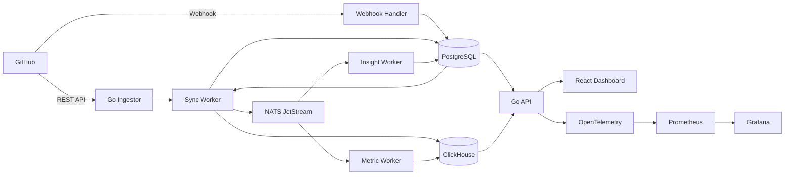

# Engineering Intelligence Platform

## 1. ภาพรวมโครงการ

Engineering Intelligence Platform คือระบบวิเคราะห์กระบวนการพัฒนาซอฟต์แวร์จากข้อมูล GitHub เช่น Pull Request, Review, Commit และ Workflow

เป้าหมายของระบบไม่ใช่การจัดอันดับนักพัฒนาจากจำนวน Commit แต่เป็นการช่วยให้ทีมเห็นปัญหาในกระบวนการทำงาน เช่น

- Pull Request รอ Review นาน
- Pull Request มีขนาดใหญ่เกินไป
- บางไฟล์ถูกแก้ไขบ่อยและมีความเสี่ยง
- งานกระจุกตัวอยู่ที่สมาชิกบางคน
- ความเร็วในการส่งมอบลดลง
- Workflow หรือ Deployment ล้มเหลวบ่อย

---

## 2. ผู้ใช้งานหลัก

### Engineering Manager

ต้องการดูภาพรวมสุขภาพของทีมและหาจุดติดขัดในกระบวนการพัฒนา

### Tech Lead

ต้องการดูคุณภาพของ Pull Request, Review Queue, Hotspot Files และความเสี่ยงของ Repository

### Developer

ต้องการดู Pull Request ที่ต้องจัดการ งานที่รอ Review และแนวโน้มการทำงานของทีม

---

## 3. Business Logic หลัก

### 3.1 เชื่อมต่อ GitHub

1. ผู้ใช้เข้าสู่ระบบ
2. ผู้ใช้ติดตั้ง GitHub App
3. Frontend เรียก Backend เพื่ออ่านสถานะการเชื่อมต่อของ Organization
4. หากยังไม่เชื่อมต่อ ระบบคืนสถานะ `not_connected` หรือ `installation_required`
5. ผู้ใช้เลือก Repository ที่อนุญาตให้ระบบอ่าน
6. ระบบบันทึก GitHub Installation ID และ Repository Access State
7. ระบบเริ่ม Initial Sync หลังผู้ใช้ยืนยัน Repository ที่ต้องการเชื่อม
8. หลังจากนั้น GitHub ส่ง Webhook เมื่อข้อมูลเปลี่ยน

Frontend ต้องสามารถแสดง state ต่อไปนี้ได้จากข้อมูลที่ Backend ส่งกลับ

- `not_connected`
- `installation_required`
- `connected`
- `syncing`
- `sync_failed`

### 3.2 Initial Sync

ระบบดึงข้อมูลย้อนหลังจาก GitHub REST API ได้แก่

- Repository
- Pull Request
- Pull Request Review
- Commit
- Changed Files
- Workflow Run
- Deployment

ระบบต้องรองรับ Pagination, Rate Limit และ Resume Sync เมื่อการดึงข้อมูลไม่สำเร็จ

### 3.3 Realtime Sync

เมื่อเกิดเหตุการณ์ใหม่ GitHub จะส่ง Webhook เข้ามา เช่น

- เปิดหรือแก้ไข Pull Request
- Merge Pull Request
- ส่ง Review
- Push Commit
- Workflow สำเร็จหรือล้มเหลว
- Deployment สำเร็จหรือล้มเหลว

Webhook จะไม่ประมวลผลข้อมูลหนักทันที แต่จะส่ง Event เข้า Queue เพื่อให้ Worker ทำงานต่อ

### 3.4 Metric Calculation

ระบบคำนวณ Metric สำคัญ เช่น

| Metric | ความหมาย |
|---|---|
| PR Cycle Time | เวลาตั้งแต่เปิด PR จน Merge |
| Review Wait Time | เวลาตั้งแต่ขอ Review จนได้รับ Review แรก |
| Review Time | เวลาที่ใช้ตั้งแต่เริ่ม Review จน Approve |
| PR Size | จำนวนไฟล์และบรรทัดที่เปลี่ยน |
| Deployment Frequency | จำนวนครั้งที่ Deploy สำเร็จ |
| Change Failure Rate | สัดส่วน Deployment ที่ล้มเหลว |
| Hotspot Score | คะแนนความเสี่ยงจากไฟล์ที่ถูกแก้บ่อยและมี Churn สูง |
| Review Coverage | สัดส่วน PR ที่ผ่านการ Review |
| Workload Distribution | การกระจาย PR และ Review ภายในทีม |

### 3.5 Insight Generation

ระบบวิเคราะห์ข้อมูลและแสดง Insight ที่เข้าใจง่าย เช่น

- PR นี้รอ Review นานกว่าค่าเฉลี่ยของทีม
- Repository นี้มี PR ขนาดใหญ่เพิ่มขึ้น
- ไฟล์นี้ถูกแก้ไขบ่อยและควรพิจารณา Refactor
- Review กระจุกตัวอยู่ที่สมาชิกบางคน
- Deployment Failure เพิ่มขึ้นในช่วง 14 วันที่ผ่านมา

> ระบบควรแสดงข้อมูลเพื่อช่วยตัดสินใจ ไม่ควรสรุปว่าใครเป็นนักพัฒนาที่ดีหรือไม่ดี

---

## 4. Feature หลัก

หมายเหตุสถานะปัจจุบัน ณ `2026-08-13`

- รายการด้านล่างเป็น product capability map
- Public API ที่ frontend ควรยึดใช้งานจริงให้ดูจาก `docs/openapi.yaml`
- สิ่งที่ยังไม่ได้ถูก promote เข้า `openapi.yaml` ให้ถือเป็น `future scope` ไม่ใช่ missing backend implementation

### Dashboard

- Team Health Summary
- PR Cycle Time
- Review Wait Time
- Deployment Frequency
- Change Failure Rate
- Open PR และ Review Queue
- Hotspot Files
- Workload Distribution
- Trend Comparison ตามช่วงเวลา

สถานะ:

- `Team Health Summary`, `PR Cycle Time`, `Review Wait Time`, `Deployment Frequency`, `Change Failure Rate`, `Open PR / Review Queue`, `Hotspot Files`, `Workload Distribution` มี backend implementation และ API contract แล้ว
- `Trend Comparison` ถือว่ารองรับผ่าน trend series และ `from` / `to` / `interval` ใน metrics endpoints ปัจจุบัน

### Repository

- รายการ Repository
- Repository Health
- Pull Request Trend
- Workflow และ Deployment
- Hotspot Files
- Contributor และ Reviewer Distribution

สถานะ:

- รายการ repository, detail, metrics, hotspots และ distribution มี backend implementation แล้ว
- `Repository Health` ใน milestone ปัจจุบันไม่ได้แยกเป็น endpoint ใหม่ และให้ derive จาก repository metrics / dashboard summary

### Pull Request

- รายละเอียด PR
- Timeline
- Review History
- Changed Files
- Cycle Time
- Review Wait Time
- PR Size
- Risk Indicator

สถานะ:

- `รายละเอียด PR`, `Timeline`, `Review History`, `Changed Files`, `PR Size`, และ `Risk Indicator` มี backend implementation แล้วใน `GET /pull-requests/{id}`
- ค่า cycle/review wait ที่ระดับ PR detail หากต้องการเพิ่มเป็น field แยก ให้ถือเป็น future enrichment ไม่ใช่ gap ของ contract ปัจจุบัน

### Insights

- Bottleneck Detection
- Large PR Detection
- Slow Review Detection
- Hotspot Detection
- Deployment Failure Trend
- Review Concentration

### Settings

- GitHub Connection
- Repository Selection
- Installation Status
- Accessible Repositories
- Sync Status
- Metric Configuration
- Data Retention
- Disconnect GitHub

สถานะ:

- `GitHub Connection`, `Repository Selection`, `Installation Status`, `Accessible Repositories`, และ `Sync Status` มี backend implementation แล้ว
- `Metric Configuration`, `Data Retention`, และ `Disconnect GitHub` ใน milestone ปัจจุบันถือเป็น internal / operations scope และยังไม่ถูก expose เป็น public frontend API

---

## 5. System Architecture

---

## 6. หน้าที่ของแต่ละระบบ

### React Frontend

- แสดง Dashboard และกราฟ
- จัดการ Filter และ Date Range
- เรียก Backend เพื่อเริ่ม GitHub App installation flow
- แสดงสถานะการเชื่อมต่อ GitHub และรายการ Repository ที่เชื่อมได้
- ให้ผู้ใช้เลือก Repository ที่ต้องการเชื่อมและเริ่ม Initial Sync
- แสดง Sync Status และ Error
- ไม่เรียก GitHub API โดยตรง

### Go API

- Authentication และ Authorization
- จัดการ GitHub App install start, callback, และ connection state
- ออก installation-scoped repository access data ให้ Frontend
- จัดการ Organization และ Repository
- อ่านข้อมูลจาก PostgreSQL และ ClickHouse
- ส่งข้อมูล Dashboard ให้ Frontend

### Go Ingestor และ Worker

- ดึงข้อมูลย้อนหลังจาก GitHub
- orchestration หลักของ sync ใช้ PostgreSQL-backed queue และ polling workers
- รับ derived event จาก NATS หลัง sync สำเร็จ
- Normalize ข้อมูล GitHub
- คำนวณและอัปเดต Metric
- generate และ refresh insight status
- Retry งานที่ล้มเหลว

### PostgreSQL

เก็บข้อมูลเชิงธุรกรรม เช่น

- User
- Organization
- GitHub Installation
- GitHub Accessible Repository State
- Repository Configuration
- Sync State
- Permission
- Audit Log

### ClickHouse

เก็บข้อมูลสำหรับ Analytics เช่น

- Pull Request Events
- Review Events
- Commit Events
- Workflow Events
- Daily Metrics
- Repository Metrics
- Aggregated Dashboard Data

### NATS JetStream

- แยก Webhook ออกจากการประมวลผล
- รองรับ Retry
- กระจายงานให้ Worker
- ลดความเสี่ยงที่ Event สูญหาย

---

## 7. หลักการออกแบบ

- Dashboard อ่านข้อมูลจากฐานข้อมูล ไม่เรียก GitHub ทุกครั้ง
- Webhook ต้องประมวลผลแบบ Idempotent
- GitHub App ใช้สิทธิ์แบบ Read-only เท่าที่จำเป็น
- แยก Application Data และ Analytics Data
- เก็บ Raw Event เท่าที่จำเป็นสำหรับ Reprocess
- Metric ทุกตัวต้องมีคำอธิบายและสูตรที่ชัดเจน
- ไม่ใช้ Metric เพื่อจัดอันดับหรือลงโทษรายบุคคล
- รองรับการเพิ่ม GitLab หรือ Bitbucket ในอนาคตผ่าน Canonical Event Model

---

## 8. ขอบเขต MVP

MVP ควรทำให้ครบ Flow ต่อไปนี้ก่อน

1. Login
2. เชื่อมต่อ GitHub App
3. อ่าน Connection Status และ Accessible Repositories จาก Backend
4. เลือก Repository
5. Initial Sync Pull Request และ Review
6. รับ Webhook
7. คำนวณ PR Cycle Time และ Review Wait Time
8. แสดง Dashboard
9. แสดง Repository Detail
9. แสดง Pull Request Detail
10. แสดง Sync Status และ Error

---

## 9. สิ่งที่ยังไม่ทำใน MVP

- รองรับ GitLab และ Bitbucket
- AI Recommendation
- Ranking นักพัฒนา
- Billing
- Mobile Application
- Enterprise SSO
- Custom Report Builder
